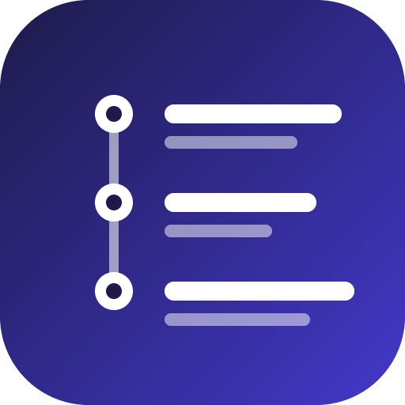

<p align="center">
  
</p>

# GitHub Digest

Your GitHub morning briefing, straight to the terminal. See all your open pull requests, assigned issues, and weekly contribution stats across every repo in one shot.

```
GitHub Digest · Thu May 8 · billydavis
────────────────────────────────────────

Last 14 days
42 commits  8 PRs opened  14 reviews given

Open pull requests (2)

 Repo              Title                        Review status    Updated 
 ────────────────  ───────────────────────────  ───────────────  ─────── 
 myorg/api-server  Add rate limiting to…        Approved         May 7   
 myorg/frontend    Refactor auth flow           Awaiting review  May 6   

Assigned issues, last 14 days (1)

 Repo              Title                        Labels           Updated 
 ────────────────  ───────────────────────────  ───────────────  ─────── 
 myorg/api-server  Investigate memory leak      bug              May 7   
```

## Installation

Requires [.NET 9 SDK](https://dotnet.microsoft.com/download) or later.

```sh
dotnet tool install --global GitHubDigest
```

## Setup

Create a GitHub [Personal Access Token](https://github.com/settings/tokens) (classic) with these scopes:

- `repo` — read PRs and issues from private repos
- `read:user` — contribution summary via GraphQL

Then set it as an environment variable:

```sh
# Windows
$env:GITHUB__TOKEN = "ghp_your_token_here"

# macOS/Linux
export GITHUB__TOKEN="ghp_your_token_here"
```

Or add it to `appsettings.local.json` in the tool directory (never commit this file):

```json
{
  "GitHub": {
    "Token": "ghp_your_token_here"
  }
}
```

## Usage

```sh
# Default: last 14 days, terminal output
github-digest

# Shorter or longer lookback
github-digest --since 7d
github-digest --since 30d

# Scope to a single repo
github-digest --repo owner/repo-name

# Export to a markdown file
github-digest --output markdown

# Output raw JSON (useful for scripting or piping)
github-digest --output json
```

The `--output markdown` flag writes a `github-digest-YYYY-MM-DD.md` file in the current directory.

The `--output json` flag writes the full report to stdout as JSON, suitable for piping into `jq` or other tools:

```json
{
  "openPullRequests": [
    {
      "repo": "myorg/api-server",
      "number": 42,
      "title": "Add rate limiting to auth endpoints",
      "url": "https://github.com/myorg/api-server/pull/42",
      "state": "open",
      "createdAt": "2026-04-30T10:00:00+00:00",
      "updatedAt": "2026-05-07T14:23:00+00:00",
      "reviewStatus": "approved",
      "baseRef": "main"
    }
  ],
  "assignedIssues": [
    {
      "repo": "myorg/api-server",
      "number": 88,
      "title": "Investigate memory leak in request handler",
      "url": "https://github.com/myorg/api-server/issues/88",
      "state": "open",
      "createdAt": "2026-05-01T09:00:00+00:00",
      "updatedAt": "2026-05-07T11:00:00+00:00",
      "labels": ["bug"]
    }
  ],
  "contributions": {
    "totalCommits": 42,
    "totalPullRequestsOpened": 8,
    "totalReviewsGiven": 14,
    "from": "2026-04-24T00:00:00+00:00",
    "to": "2026-05-08T00:00:00+00:00"
  },
  "username": "billydavis"
}
```

## Building from source

```sh
git clone https://github.com/billydavis/github-digest
cd github-digest/GitHubDigest
dotnet run -- --since 7d
```

To pack and install locally:

```sh
dotnet pack
dotnet tool install --global --add-source ./bin/Release GitHubDigest
```

## Tech stack

- [Octokit](https://github.com/octokit/octokit.net) — GitHub REST API
- [Octokit.GraphQL](https://github.com/octokit/octokit.graphql.net) — GitHub GraphQL API
- [Spectre.Console](https://spectreconsole.net) — terminal rendering
- [System.CommandLine](https://github.com/dotnet/command-line-api) — CLI flags
- .NET 9 · packaged as a `dotnet tool`
